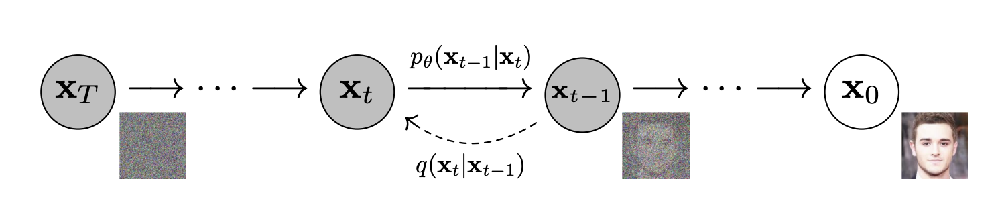
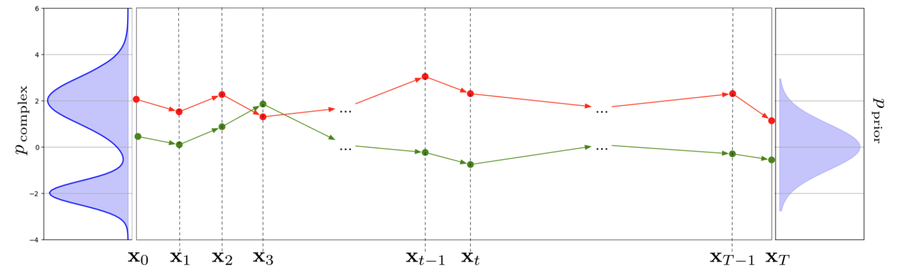

# Denoising Diffusion Probabilistic Models

## the idea of ddpm

由flow model，我们知道可以定义一些列变量的变换，从而由一个已知的随机变量分布变换到数据的随机变量分布。但flow模型面对诸多限制，比如，每一步路径的形式是受限的，并且每一步变换是确定的。

diffusion和flow模型的一个不同在于，diffusion的变量来自一个随机的path, 而flow的变量来自一个确定的path。diffusion模型约定一个已知的前向过程，通过前向过程构造中间状态变量的样本，然后由这些样本学习一个反向markov过程(可以证明这样的过程是存在的），在采样的时候，只需要从prior分布中采样，然后经过反向过程得到复合原始分布的数据。

相比flow模型，ddpm模型有这样的优势：
1. 只约束中间变量的概率分布，而用一个模型学习这种变换（而不是具体形式的变换），因此可以有更高的自由度。
2. 可以约束中间状态分布，而不是像normalizing flow对中间状态不加约束。

图示为diffusion模型的markov chain变量变换过程。

它的前向过程是markov的，$q(x_{1:T} | x_0)$ 的联合概率分解为马尔可夫链的乘积形式：
\[
q(x_{1:T} | x_0) = q(x_1 | x_0) \prod_{t=2}^{T} q(x_t | x_{t-1}) = \prod_{t=1}^{T} q(x_t | x_{t-1}).
\]

定义单步扩散的核为
\[q(x_t|x_{t-1}) = K(x_t|x_{t-1};\beta_t)
\]

可以证明[Feller, 1949], 在无限小的变换近似下，反向过程和正向过程具有相同的分布形式。这意味着，可以用神经网络拟合反向过程的参数分布。

## ddpm with Gaussian Kernel
下面给出高斯核的ddpm训练loss的具体形式和关键推导过程。

前向过程（基于 [Sohl-Dickstein et al., 2015]）：
\[
q(x_t | x_{t-1}) = \mathcal{N}(x_t; \sqrt{1 - \beta_t} x_{t-1}, \beta_t \mathbf{I}),
\]
其中：
- \(\mathcal{N}\) 表示高斯分布，
- \(\sqrt{1 - \beta_t} x_{t-1}\) 是均值，
- \(\beta_t \mathbf{I}\) 是协方差矩阵（各向同性噪声）。

定义 \( \alpha_t = 1 - \beta_t \)，扩散过程逐步生成 \( X_t \)：
\[
X_t = \sqrt{\alpha_t} X_{t-1} + \sqrt{1 - \alpha_t} Z_t
\]
递推展开后：
\[
X_t = \sqrt{\alpha_t \alpha_{t-1}} X_{t-2} + \sqrt{\alpha_t (1 - \alpha_{t-1})} Z_{t-1} + \sqrt{1 - \alpha_t} Z_t 
\]
合并噪声项：
\[
X_t = \sqrt{\alpha_t \alpha_{t-1}} X_{t-2} + \sqrt{1 - \alpha_t \alpha_{t-1}} Z_{t-1:t}
\]
最终直接关联初始状态 \( X_0 \)：
\[
X_t = \sqrt{\bar{\alpha}_t} X_0 + \sqrt{1 - \bar{\alpha}_t} Z_{0:t}, \quad \bar{\alpha}_t = \prod_{i=1}^t \alpha_i 
\]

因此前向过程
\[
q(\mathbf{x}_t \mid \mathbf{x}_0) = \mathcal{N}\left( \mathbf{x}_t; \sqrt{\bar{\alpha}_t} \, \mathbf{x}_0, (1 - \bar{\alpha}_t)\mathbf{I} \right)
\]

可以基于$\mathbf{x}_0$的一步采样
\[
\mathbf{x}_t = \sqrt{\bar{\alpha}_t} \, \mathbf{x}_0 + \sqrt{1 - \bar{\alpha}_t} \, \varepsilon, \quad \varepsilon \sim \mathcal{N}(\mathbf{0}, \mathbf{I})
\]

>对应多元高斯分布形式为
\[\mathcal{N}(x; \mu, \Sigma) = \frac{1}{\sqrt{(2\pi)^k \det \Sigma}} \exp\left(-\frac{1}{2}(x - \mu)^T \Sigma^{-1}(x - \mu)\right).\]
    - \( x \): 随机变量向量，
    - \( \mu \): 均值向量，
    - \( \Sigma \): 协方差矩阵，
    - \( k \): 向量维度。
若 \( X \sim \mathcal{N}(\mu, \Sigma) \)，可通过线性变换从标准高斯分布生成：\[X = \mu + AZ, \quad Z \sim \mathcal{N}(0, I),\]其中 \( A \) 满足 \( \Sigma = AA^T \)。

可以证明[Feller, 1949], 在无限小的变换近似下，反向过程和正向过程具有相同的分布形式。因此对以上高斯kernel，它的反向过程也是高斯的。在已知$x_0$的条件下，进一步可以计算得到闭形式

\[
q(\mathbf{x}_{t-1} \mid \mathbf{x}_t, \mathbf{x}_0) = \mathcal{N}\left(\mathbf{x}_{t-1}; \tilde{\mu}(\mathbf{x}_t, \mathbf{x}_0), \tilde{\beta}_t \mathbf{I}\right)
\]
其中
\[
\tilde{\beta}_t = \frac{1 - \bar{\alpha}_{t-1}}{1 - \bar{\alpha}_t} \cdot \beta_t
\]

\[
\tilde{\mu}_t(\mathbf{x}_t, \mathbf{x}_0) = \frac{\sqrt{\alpha_t} (1 - \bar{\alpha}_{t-1})}{1 - \bar{\alpha}_t} \mathbf{x}_t + \frac{\sqrt{\bar{\alpha}_{t-1}} \beta_t}{1 - \bar{\alpha}_t} \mathbf{x}_0
\]

因此我们有理由用模型反向建模马尔可夫链的联合概率：
\[
P_\theta(x_{0:T}) = p(x_T) \prod_{t=1}^T P_\theta(x_{t-1} \mid x_t).
\]

\[
P_\theta(x_{t-1} \mid x_t) = \mathcal{N}\left(x_{t-1}; \mu_\theta(x_t, t), \tilde{\beta}_t \mathbf{I}\right)
\]

只需要一个模型在已知$x_t, t$的条件下预测过程的$\mu_t$，就可以给出反向过程。

注意：此处变量都是随机变量，前向过程约定了数据分布到已知分布的过程，并构造了中间的随机变量。但只有最终的分布是已知，所以在反向马科夫过程构造初始分布的时候，我们只有从$x_t$出发，一步步建模可跟踪的条件概率，并基于条件概率得到采样序列。没有办法知道$x_0$，因为我们构造的是概率变换，而不是一一映射。

## loss

根据ELBO，可以写出

\[
    \log p(x_0) \geq \mathbb{E}_{q} \left[ \log \frac{p_\theta(x_{0:T})}{q(x_{1:T} \mid x_0)} \right]
\]

对应的变分下界作为损失函数
\[
L_{\text{VLB}} = \mathbb{E}_{q(\mathbf{x}_{0:T})} \left[ \log \frac{q(\mathbf{x}_{1:T} \mid \mathbf{x}_0)}{p_\theta(\mathbf{x}_{0:T})} \right] \geq -\mathbb{E}_{q(\mathbf{x}_0)} \left[ \log p_\theta(\mathbf{x}_0) \right]
\]

将以上概率通过markov chain展开，并使用bayes公式进行一些变形之后可以得到(这是diffusion的核心公式，在离散diffusion工作中也有类似的公式)

\[
    L_{VLB} = \mathbb{E}_{q(\boldsymbol{x}_0)} [ D_{\text{KL}}[q(\boldsymbol{x}_T|\boldsymbol{x}_0)||p(\boldsymbol{x}_T)] + \sum_{t=2}^T \mathbb{E}_{q(\boldsymbol{x}_t|\boldsymbol{x}_0)} \left[D_{\text{KL}}[q(\boldsymbol{x}_{t-1}|\boldsymbol{x}_t, \boldsymbol{x}_0)||p_\theta(\boldsymbol{x}_{t-1}|\boldsymbol{x}_t)]\right] - \mathbb{E}_{q(\boldsymbol{x}_1|\boldsymbol{x}_0)} [\log p_\theta(\boldsymbol{x}_0|\boldsymbol{x}_1)]
\]

两个高斯分布的KL是有公式的，写出来为

$$\begin{align*}
L_t 
&= \mathbb{E}_{x_0, \epsilon} \left[ 
    \frac{1}{2 \|\Sigma_\theta(x_t, t)\|_2^2} 
    \left\| \tilde{\mu}_t(x_t, x_0) - \mu_\theta(x_t, t) \right\|^2 
\right] \\
&= \mathbb{E}_{x_0, \epsilon} \left[ 
    \frac{1}{2 \|\Sigma_\theta\|_2^2} 
    \left\| 
        \frac{1}{\sqrt{\alpha_t}} \left( 
            x_t - \frac{1 - \alpha_t}{\sqrt{1 - \bar{\alpha}_t}} \epsilon_t 
        \right) 
        - 
        \frac{1}{\sqrt{\alpha_t}} \left( 
            x_t - \frac{1 - \alpha_t}{\sqrt{1 - \bar{\alpha}_t}} \epsilon_\theta(x_t, t) 
        \right) 
    \right\|^2 
\right] \\
&= \mathbb{E}_{x_0, \epsilon} \left[ 
    \frac{1}{2 \|\Sigma_\theta\|_2^2} 
    \left\| 
        \frac{1 - \alpha_t}{\sqrt{\alpha_t (1 - \bar{\alpha}_t)}} 
        \left( \epsilon_t - \epsilon_\theta(x_t, t) \right) 
    \right\|^2 
\right] \\
&= \mathbb{E}_{x_0, \epsilon} \left[ 
    \frac{(1 - \alpha_t)^2}{2 \alpha_t (1 - \bar{\alpha}_t) \|\Sigma_\theta\|_2^2} 
    \left\| \epsilon_t - \epsilon_\theta(x_t, t) \right\|^2 
\right] \\
&= \mathbb{E}_{x_0, \epsilon} \left[ 
    \frac{(1 - \alpha_t)^2}{2 \alpha_t (1 - \bar{\alpha}_t) \|\Sigma_\theta\|_2^2} 
    \left\| 
        \epsilon_t - \epsilon_\theta\left( 
            \sqrt{\bar{\alpha}_t} x_0 + \sqrt{1 - \bar{\alpha}_t} \epsilon_t, t 
        \right) 
    \right\|^2 
\right]
\end{align*}$$

可以看到，忽略已知部分，可以让模型直接预测第t时间随机变量相比0时刻的偏移量。在 DDPM 中，常忽略加权系数，直接优化 \( \|\epsilon_t - \epsilon_\theta(x_t, t)\|^2 \)。

## sampling

由于我们已经可以从$x_t$预测下一步分布的$\mu(x_{t-1}|x_t, x_0)$，可以直接从$x_{t-1}$分布中采样
\[
q(\mathbf{x}_{t-1} \mid \mathbf{x}_t, \mathbf{x}_0) = \mathcal{N}\left(\mathbf{x}_{t-1}; \tilde{\mu}(\mathbf{x}_t, \mathbf{x}_0), \tilde{\beta}_t \mathbf{I}\right)
\]

\[
    \tilde{\mu}(\mathbf{x}_t, \mathbf{x}_0) = \frac{1}{\sqrt{\alpha_t}} \left( x_t - \frac{1 - \alpha_t}{\sqrt{1 - \bar{\alpha}_t}} \epsilon_\theta(x_t, t) \right)
\]
## correlation with score matching

实际上，后续有工作证明了优化ddpm的loss可以通过score matching进行

\[
\theta^* = \arg \min_{\theta} \sum_{t=1}^T \sigma_t^2 \mathbb{E}_{q(x_0)} \mathbb{E}_{q(x_t|x_0)} \left[ \| s_\theta(x_t, t) - \nabla_{x_t} \log q(x_t|x_0) \|_2^2 \right]
\]

其中，\(s_\theta(x_t, t)\)：扩散模型学习的**得分函数**（score function），用于近似真实数据分布的梯度 \(\nabla_{x_t} \log q(x_t|x_0)\)，\(\nabla_{x_t} \log q(x_t|x_0)\)：真实噪声分布的对数梯度（即 Stein 得分）， \(\sigma_t^2\)：时间步 \(t\) 的权重系数（通常与噪声调度相关），\(q(x_0)\)：真实数据分布，\(q(x_t|x_0)\)：前向扩散过程的条件分布。

## reference

1. [what are diffusion models-LilianWeng](https://lilianweng.github.io/posts/2021-07-11-diffusion-models/)
2. [Denoising Diffusion Probabilistic Models](https://arxiv.org/pdf/2006.11239)