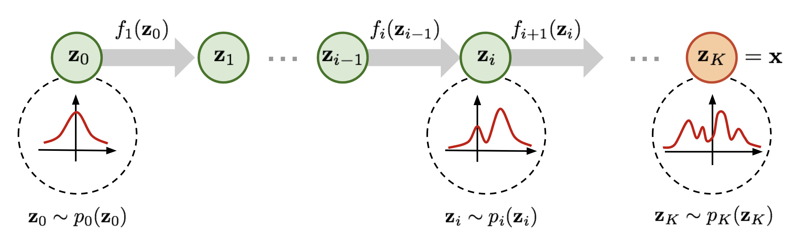

# 最形式化的概率变换：流模型

## 概率变换形式
假设样本服从某个分布$p(x)$, 该分布由某个$z\sim p_z(z)$分布变换过来$x = f(z)$, 其中$p_z$是某个已知分布，一般我们会认为是高斯分布。

那么由 **变换概率密度的公式**（change of variables），我们有：

\[
p(x) = p_z(f^{-1}(x)) \cdot \left| \det \left( \frac{\partial f^{-1}(x)}{\partial x} \right) \right|
\]

等价地，可以写成：

\[
p(x) = p_z(z) \cdot \left| \det \left( \frac{\partial f(z)}{\partial z} \right)^{-1} \right| = p_z(z) \cdot \left| \det \left( \frac{\partial f(z)}{\partial z} \right) \right|^{-1}
\]

该公式想要成立，需要满足该映射是可微双射的，这意味着Jacobi矩阵是满秩方阵。

----
满足要求变换可以有很多形式，流模型首先选择一些满足要求的变换，然后通过复合得到复杂的变换

一个简单的变换形式：RealNVP 中提出的 **Affine Coupling Layer**

设输入x是偶数维的特征， $x = [x_1, x_2]$，$x1, x2$分别是前d/2和后d/2维的元素，令：$z = f^{-1}(x)$ 形式为

\[
\begin{cases}
z_1 = x_1 \\
z_2 = x_2 \odot \exp(s_\theta(x_1)) + t_\theta(x_1)
\end{cases}
\]

- $s$, $t$ 是神经网络, $\theta$为神经网络的参数（统一写作theta， 实际上每一个s, t都有单独的参数，可以写作$\theta_s$, $\theta_t$）
- $\odot$ 是元素对位乘法
- 这个变换是可逆的，逆变换 $x=f(z)$ 为：

\[
\begin{cases}
x_1 = z_1 \\
x_2 = (z_2 - t_\theta(z_1)) \odot \exp(-s_\theta(z_1))
\end{cases}
\]

Jacobian 是**下三角矩阵**，所以其行列式很容易计算：

\[
\log \left| \det \left( \frac{\partial y}{\partial x} \right) \right| = \sum\limits_{d/2} \text{s}(x_1)
\]

通过多次进行**Affine Coupling Layer**变换，我们可以构造一个更复杂的变换$x= f(z)$
\[
f = f_K \circ f_{K-1} \circ \dots \circ f_1
\]

记多层复合函数的中间层变量为 \[
h_i = f_i \circ f_{i-1} \circ \dots \circ f_1, h_K = z, h_0 = x
\]

那么该变换的Jacobi矩阵是
\[
\frac{\partial z}{\partial x} 
= \frac{\partial h_K}{\partial h_{K-1}} 
\cdot \frac{\partial h_{K-1}}{\partial h_{K-2}} 
\cdot \dots 
\cdot \frac{\partial h_1}{\partial h_0}
= \prod_{i=1}^{K} \frac{\partial h_i}{\partial h_{i-1}}
\]

复合变换对应的概率密度变换公式为
\[
p(x) = p_z(z) \cdot \left| \det \left( \frac{\partial f(z)}{\partial z} \right) \right|^{-1}
 = p_Z(h_K) \cdot \prod_{i=1}^K \left| \det \left( \frac{\partial h_i}{\partial h_{i-1}} \right) \right|^{-1} = p_Z(h_K) \cdot \prod_{i=1}^K \left| \det \left( \frac{\partial h_{i-1}}{\partial h_{i}} \right) \right|
\]

\[
\log p_\theta(x) = \log p_z(z) - \sum_{k=1}^K \log \left| \det \left( \frac{\partial f_k}{\partial h_{k-1}} \right) \right| = 
\log p_z(z) + \sum_{k=1}^K \log \left| \det \left( \frac{\partial f^{-1}_{k}}{\partial h_k} \right) \right|
\]
如果其中每一个$f_i$都是形如affine Coupling Layer中的变换形式，那么
\[
\log p_\theta(x) =  \log p_z(z) + \sum_{k=0}^{K-1} \sum\limits_{d/2}s(h_k)
\]

这样，由于z的概率分布已知(高斯)，我们可以显式得到x的分布。在训练的时候我们要做的就是调整这个含参数分布，使得到的$p(x)$符合数据的分布。

## 训练流模型
衡量两个分布的距离可以使用KL散度
\[
\mathcal{L} = \mathrm{KL}[p_{data}(x) || p_\theta(x)] = \mathbb{E}_{x \sim p_{data}(x)} \left[ \log p_\theta(x) \right] + \text{const}
\]

而 $\log p_\theta(x)$ 通过前述 Jacobian 累积项和 base distribution $p_z$ 来显式计算。
这一项等价于，从数据中取样，计算流模型的
\[
\mathbb{E}_{x \sim p_{data}(x)} \left[\log p_z(z=f^{-1}(x)) + \sum_{k=0}^{K-1} \sum\limits_{d/2}s(h_k)\right]
\]

通过反向传播优化神经网络最小化这一项loss，得到的模型可以正确建模数据分布p

## 采样
采样的时候，我们可以直接从Gaussian分布采样z，然后经过f变化得到x。此时我们采样的分布就是$p_\theta(x)$， 而我们知道它等价于模型的分布

## Reference

1. Lilian Weng’s blog: [https://lilianweng.github.io/lil-log/2018/10/13/flow-based-deep-generative-models.html](https://lilianweng.github.io/lil-log/2018/10/13/flow-based-deep-generative-models.html)

2. **RealNVP**  
   *Dinh et al., "Density Estimation using Real NVP", 2017*  
   [https://arxiv.org/abs/1605.08803](https://arxiv.org/abs/1605.08803)

3. 苏剑林's blog: [https://kexue.fm/archives/5776](https://kexue.fm/archives/5776)

4. Jakub M. Tomczak's blog: [https://jmtomczak.github.io/blog/3/3_flows.html](https://jmtomczak.github.io/blog/3/3_flows.html)

## 没读过的
1. **Glow**  
   *Kingma & Dhariwal, "Glow: Generative Flow with Invertible 1x1 Convolutions", 2018*  
   [https://arxiv.org/abs/1807.03039](https://arxiv.org/abs/1807.03039)

2. **Rezende et al., 2015** — *Variational Inference with Normalizing Flows*  
   https://arxiv.org/abs/1505.05770  
   👉 提出使用一系列 invertible transform 改善变分推断。
