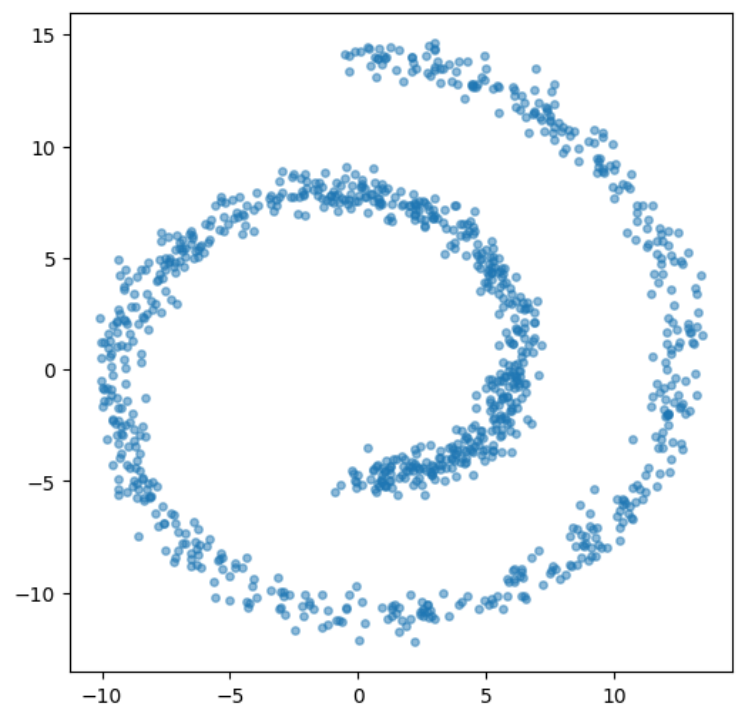

## Generative vs Predictive

1. 预测

回归
- **目标**：学习 $f_\theta(x)$ 来预测 $y$
- **损失函数**：
  $$
  \mathbb{E}_{x \sim p_{data}(x)}\left[|f_\theta(x) - y|\right]
  $$

分类

- **建模**：将 $y$ 视为随机变量，假设条件概率 $p_\theta(y \mid x)$
- **目标**：最大化对数似然
- **损失函数**：
  $$
  \mathbb{E}_{x \sim p_{data}(x)}\left[\log p_\theta(y)\right]
  $$

2. 生成

- **目标**：学习分布 $p_\theta(x)$ 拟合真实数据分布 $p_{data}(x)$
- **损失函数**（最小化 KL 散度）：
  $$
  \text{KL}[p_{data}(x)\|p_\theta(x)] = \mathbb{E}_{x \sim p_{data}(x)}\left[\log p_{data}(x) - \log p_\theta(x)\right]
  $$

Take **Swiss Roll** as an example

$x \in \mathbb{R}^2$, $y \in \mathbb{R}$, $y = f(x)$，其中 $f$ 是从二维平面到实数的映射。

- 预测: $\hat{y} = f_\theta(x)$
- 生成 $p_\theta(x)$ 拟合观测分布 $p_data(x)$，并从$p_{theta}(x)$中采样

